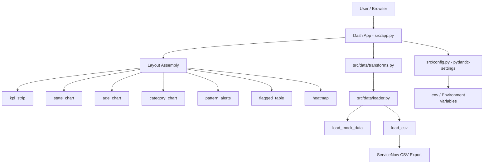

# System Architecture

## Overview

Ticket Dashboard is a local-first Plotly Dash application for ITS Service Desk Hardware Repair analytics. It renders six sections (KPI strip, state/volume charts, age/category charts, pattern alerts, flagged ticket table, location heat map) from a seeded mock dataset or a real ServiceNow CSV export. All data computation is performed in pure transform functions; Dash components are purely presentational.

## Runtime Targets

- **Local:** development, prototyping — `python -m src.main` at http://localhost:8050
- **Cloud:** none yet (TBD)
- **Edge:** Raspberry Pi optional when HARDWARE_ENABLED=true

## Component Map

## Layer Responsibilities

- **Dash App (`src/app.py`):** layout assembly, callback registration (heat map toggle), startup
- **Components (`src/components/`):** pure presentational functions; accept pre-computed dicts, return Dash elements
- **Transforms (`src/data/transforms.py`):** pure functions computing KPIs, state breakdown, monthly volume, age distribution, category breakdown, pattern alerts, flagged tickets, location heat map
- **Loader (`src/data/loader.py`):** seeded mock data (1,102 tickets matching screenshots) and CSV import with Pydantic validation
- **Config (`src/config.py`):** pydantic-settings BaseSettings; loaded once at startup

## Key Constraints

- Secrets never leave the environment layer
- All data from CSV is validated via Pydantic before use
- Mock data is deterministically seeded (random.Random(42)) — always reproducible
- Hardware layer must degrade gracefully when not on Pi hardware
- No network calls at runtime; all data is local
